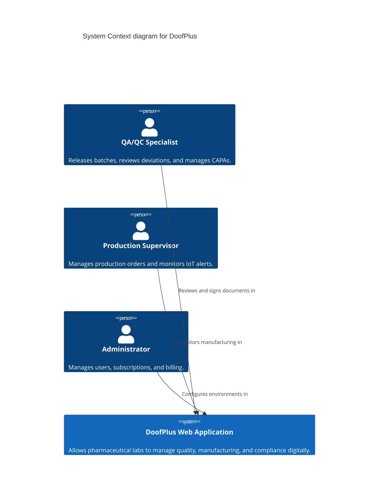
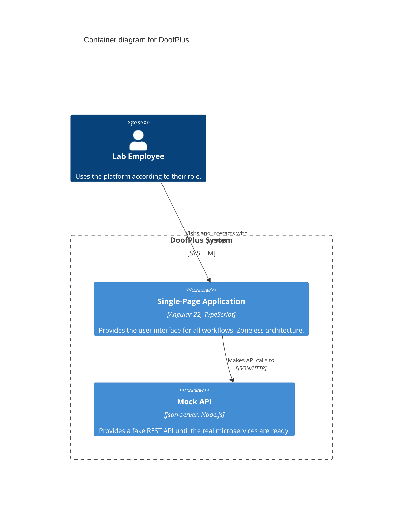
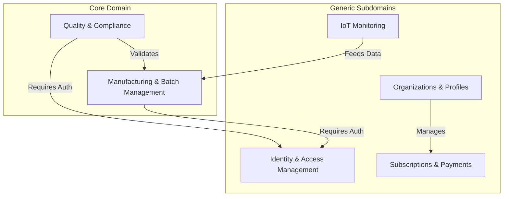
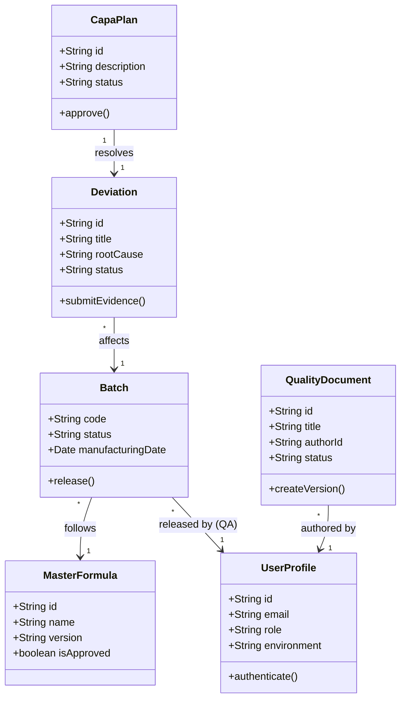

# Architecture Diagrams

This document contains the structural diagrams for the DoofPlus platform.

## 1. Context Diagram (C4 - Level 1)

## 2. Container Diagram (C4 - Level 2)

## 3. Bounded Context Map (DDD)

## 4. Class Diagram (Domain Model)

